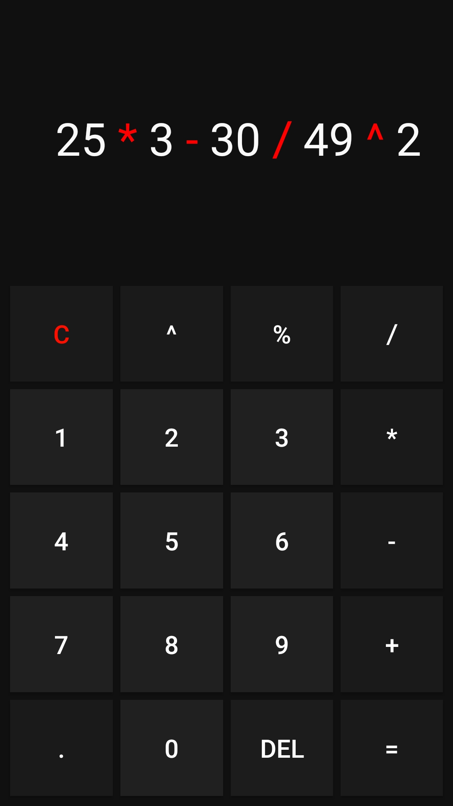

# App de Calculadora

Aplicativo de praticar a criação de apps Android

## Desenvolvimento

Esse projeto foi realizado no Aplicativo
chamado AIDE, um app que tem uma IDE Android,
com alguns cursos iniciais para aprender a usar
o app e seus recursos

## Motivação

Sempre gostei de como tudo funciona no Android,
para criar automações com outro app chamado
Tasker, com esse app gostaria de me aprofundar
no básico do desenvolvimento de apps
